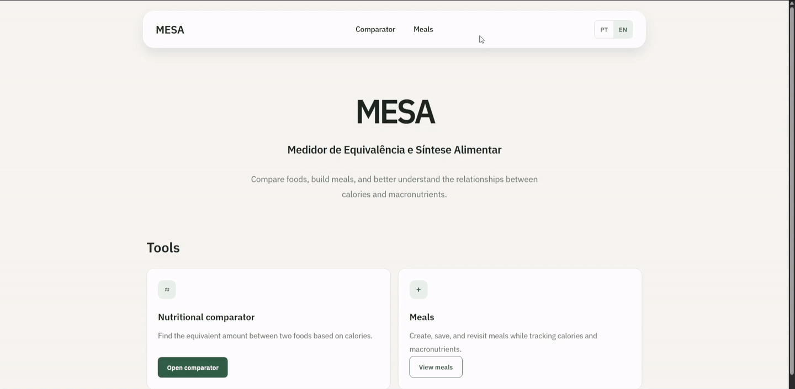
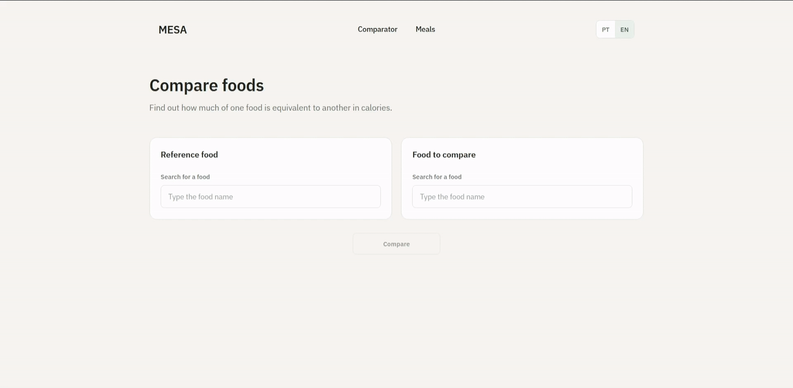
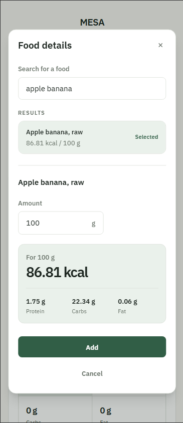

# MESA

[](https://github.com/caalel/mesa/actions/workflows/ci.yml)
[](LICENSE)

**Medidor de Equivalência e Síntese Alimentar**

MESA brings together two practical nutritional tools: a food comparator with nutrient-based equivalence and a meal calculator. Users can compare equivalent food amounts by calories, protein, carbohydrates, or fat, or assemble meals while tracking calories and macronutrients.

## About the project

MESA is a Laravel and Livewire MVP for clear, practical food comparison and meal assembly. The Home page is the hub for the Nutritional Comparator and Meals. Its interface is available in Brazilian Portuguese (`pt_BR`) and English (`en`). All nutritional data is prepared and stored locally, so neither tool depends on external APIs at runtime.

## Features

- Multi-term food search with relevance-based result ranking in the active locale.
- Localized food names and interface copy in `pt_BR` and `en`, without fallback between food-name languages.
- Initial language detection from `Accept-Language`, with a manual language selector remembered in the session.
- Home page with direct access to both tools.
- Nutritional Comparator: Food A and Food B selection, Food A weight validation, automatic equivalence by calories, protein, carbohydrates, or fat, and complete nutritional summaries for both foods.
- Optional accounts with registration, sign in, and sign out.
- Meals: create, edit, and delete meals in the current session as a guest or in
  the database when signed in.
- Guest Meals migrate atomically to an account after successful registration or
  sign in; existing account Meals are preserved.
- Meal drafts with localized Food search, nutritional preview by weight, duplicate-weight merging, editing and removal of Foods, and a maximum of 10 distinct Foods.
- Nutritional summaries for meal drafts and saved meals, including calories, protein, carbohydrates, and fat.
- A maximum of eight search results.
- Weight input that accepts a point or comma as the decimal separator.
- Friendly validation feedback and a maximum weight of 10,000 g.
- Locale-aware number formatting, with positive values below `0.01` displayed as less than `0.01` instead of zero.
- Automatic smooth scrolling to the result.
- Responsive interface.
- Local prepared nutritional dataset.
- Idempotent food imports.
- Artisan import command with dry-run support.
- Database seeder integrated with Laravel's standard seeding flow.
- Automated tests.

## Screenshots

### Meal Calculator



### Nutritional Comparator



### Responsive Interface



## Technologies

- PHP 8.3
- Laravel 13
- Livewire 4
- Blade
- Tailwind CSS 4
- Vite
- MySQL
- Pest/PHPUnit

## Nutritional data

TACO 4 is the primary scientific source, while `brolesi/taco` is the normalized technical processing source. Preparation decisions and overrides are explicit and reproducible. The prepared CSV currently contains 592 foods.

USDA FoodData Central complements only the nutritional values of TACO codes 457 and 458; TACO identity remains preserved for both records. The application does not query USDA or any other nutritional API at runtime.

[Data sources and preparation](docs/data-sources.md)

## Requirements

- PHP 8.3 or later
- Composer
- Node.js 20.19+ or 22.12+
- npm
- MySQL

## Installation

Clone the repository and install the PHP and frontend dependencies:

```bash
git clone https://github.com/caalel/mesa.git
cd mesa
composer install
npm ci
```

Create the local environment file:

```bash
cp .env.example .env
```

On Windows:

```powershell
copy .env.example .env
```

Generate the application key:

```bash
php artisan key:generate
```

Create a MySQL database and configure its connection in `.env`. Never commit database credentials.

Create the schema, import the official food dataset, and compile frontend assets:

```bash
php artisan migrate --seed
npm run build
```

`migrate --seed` creates the schema and imports the official food dataset. A clean clone does not need to regenerate food files before this step: the required generated CSVs are versioned.

`php artisan migrate:fresh --seed` is available for a full local reset, but it is destructive: it drops the existing database tables before recreating and seeding them.

After creating the MySQL database and configuring its connection in `.env`, you
may run the optional setup shortcut:

```bash
composer setup
```

It generates the application key, runs the migrations, imports the official
dataset through the seeder, installs the frontend dependencies from the
lockfile, and builds the frontend assets.

The script can create `.env` from `.env.example` when the file is missing, but the
database connection must be configured before the migration step.

The manual steps above remain available when you need to run each stage separately.

## Running the application

Use Laravel's standard development flow:

```bash
php artisan serve
npm run dev
```

`php artisan serve` starts Laravel's local server, and `npm run dev` starts Vite for frontend development. These commands are optional when the project is served through Laragon, Docker, Valet, Herd, or another local web server.

## Food import commands

```bash
php artisan foods:import --dry-run
php artisan foods:import
```

The dry run validates the CSV without persisting data. The normal command inserts or updates valid foods, and imports are idempotent. By default, the command uses `database/data/foods/taco-v4.csv`.

`php artisan migrate --seed` already imports the official dataset through the seeder. See [Architecture](docs/architecture.md) for advanced import details.

## Dataset maintenance

Normal installation and seeding use the versioned canonical dataset. Regenerate data only when maintaining the editorial translations or documented source decisions:

```bash
php artisan foods:generate-translations
php scripts/prepare_taco_csv.php
php artisan foods:import --dry-run
php artisan foods:import
```

The generation command produces the operational English translation file, and the preparation script combines the TACO source, reviewed overrides, and translations into the canonical CSV. Review the generated diffs before importing or committing them. See [Data sources and preparation](docs/data-sources.md) for the complete pipeline and command options.

## Test environment

Tests use a dedicated MySQL database named `mesa_testing`, never the development database. Create it locally, then create the local test environment file:

```bash
cp .env.testing.example .env.testing
php artisan key:generate --env=testing
```

On Windows:

```powershell
copy .env.testing.example .env.testing
php artisan key:generate --env=testing
```

The key-generation command writes the application key to `.env.testing`. Configure in that file only the local connection details (host, port, user, and password). Never commit real credentials. The project has technical protection that keeps the suite on the dedicated test database; if it is unavailable, tests fail instead of using the development database. See [Architecture](docs/architecture.md) for technical details.

## Tests and build

```bash
php artisan test
npm run build
```

The test command validates domain, Livewire, HTTP, import, command, seeder, Comparator, Meals, and integration behavior. The build command validates production frontend asset compilation.

## Technical decisions

- Domain and import logic are isolated in services.
- TDD is used for behavior changes.
- Multi-term matching and relevance ranking run in the database.
- Imports are idempotent through composite source identity.
- A local, reproducible dataset replaces runtime nutritional APIs.
- Livewire provides interactive, server-driven UI behavior.

[Architecture](docs/architecture.md)<br>
[Interface design](docs/design.md)

## MVP limitations

- Each equivalence matches one selected nutrient; it does not establish complete nutritional equivalence.
- Nutritional values are references per 100 g.
- Real composition may vary by brand, origin, preparation, and processing.
- The project does not replace professional nutritional guidance.
- Authentication is intentionally limited to registration, sign in, and sign out;
  it has no password recovery, email verification, social login, two-factor
  authentication, passkeys, or account-management interface.
- Guest Meals are limited to the current session. Signed-in users have
  user-owned persisted Meals, and guest Meals migrate to the account after a
  successful authentication.
- The MVP has no user-created custom foods.
- Search does not include typo-tolerant fuzzy matching.

## Documentation

- [Architecture](docs/architecture.md)
- [Interface design](docs/design.md)
- [Data sources and preparation](docs/data-sources.md)
- [Agent instructions](AGENTS.md) — instructions for coding agents working on this repository.

## License

The MESA source code is available under the [MIT License](LICENSE).

Nutritional datasets and third-party source materials retain their own attribution
and licensing terms, documented in
[Data sources and preparation](docs/data-sources.md).
