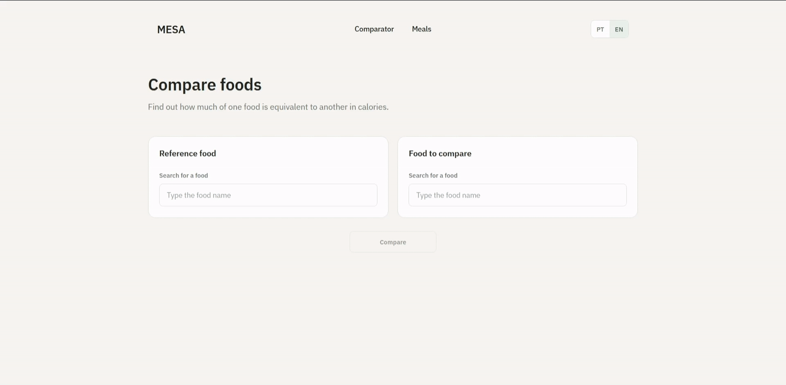
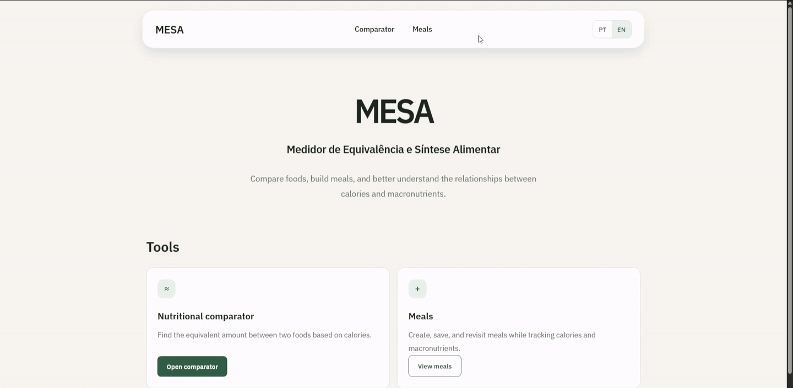
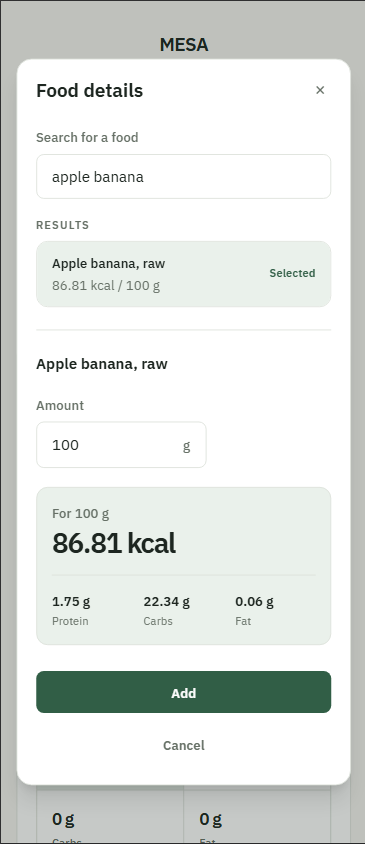

# MESA

[](https://github.com/caalel/mesa/actions/workflows/ci.yml)
[](LICENSE)

**Medidor de Equivalência e Síntese Alimentar**

MESA brings together two practical nutritional tools: a food comparator with nutrient-based equivalence and a meal calculator. Users can compare equivalent food amounts by calories, protein, carbohydrates, or fat, or assemble meals while tracking calories and macronutrients.

## Features

### Nutrition & Search

- **Database-ranked, locale-aware food search** with multi-term matching that prioritizes full-prefix and first-term-prefix results before other compatible matches.
- **Automatic food-equivalence calculation** by calories, protein, carbohydrates, or fat, with complete nutritional summaries for both portions and recalculation as inputs change.

### Meals & Persistence

- **Full meal lifecycle for guests and authenticated users**, including creation, editing, deletion, nutritional previews, and calculated meal totals.
- **Dual persistence model:** guest meals remain session-backed, while authenticated meals are user-owned records persisted in MySQL with reads and writes scoped to the authenticated account.
- **Atomic guest-to-account migration** on registration or sign-in, preserving existing account meals and retaining guest data if migration fails.

### Data Pipeline

- **Reproducible TACO 4 ingestion pipeline** that combines the preserved source dataset, reviewed English translations, explicit nutritional overrides, and documented removals into the canonical application dataset.
- **Strict validation and traceability** across source codes, translation coverage, duplicate records, nutritional values, override references, and editorial review status before generated data is accepted.
- **Idempotent imports through composite source identity and upserts**, with Artisan dry-run support and standard Laravel seeding; nutritional data is stored locally with no runtime dependency on external food APIs.

### Localization & Interface

- **Bilingual `pt_BR` / `en` experience** covering interface copy, food names, locale-specific search, and nutritional number formatting.
- **Locale resolution from `Accept-Language` with session-persisted manual switching**, while food search intentionally stays within the active language rather than silently falling back across datasets.
- **Reactive Livewire interface** with responsive layouts, contextual validation, and nutritional feedback across the comparator and meals workflows.

## Screenshots

### Nutritional Comparator



### Meal Calculator



### Responsive Interface



## Architecture

- Livewire components coordinate UI workflows while dedicated services handle food search, weight validation, nutritional calculations shared by both tools, and equivalence. Nutritional values are derived from persisted `Food` records.
- Guest meals are stored in session, while authenticated meals are user-owned records in MySQL. Guest-to-account migration is transactional: registration rolls back User and Meal writes on failure, and login migration retains guest data and logs the user out if persistence fails.
- The reproducible TACO 4 pipeline combines the normalized technical source, reviewed translations, and documented overrides into the canonical dataset imported locally by `FoodImporter`; runtime does not call nutritional APIs.

[Read the architecture documentation →](docs/architecture.md)

## Technologies

- PHP 8.3
- Laravel 13
- Livewire 4
- Tailwind CSS 4
- MySQL
- Pest/PHPUnit

## Quality & Testing

- **300+ automated tests with Pest/PHPUnit** covering service logic, Livewire flows, authentication, session and database persistence, localization, data imports, Artisan commands, seeders, and regression-critical behavior.
- **TDD is used for behavior changes**, with tests written to define the expected contract before production code is changed.
- **GitHub Actions CI** runs the automated test suite and production frontend build on pushes and pull requests to `main`.
- **Dedicated MySQL test environment** keeps the test suite isolated from development data and fails safely if the expected testing database is unavailable.

## Nutritional data

TACO 4 is the primary scientific source, while `brolesi/taco` is the normalized technical processing source. Preparation decisions and overrides are explicit and reproducible. The prepared CSV currently contains 592 foods.

USDA FoodData Central complements only the nutritional values of TACO codes 457 and 458; TACO identity remains preserved for both records. The application does not query USDA or any other nutritional API at runtime.

[Data sources and preparation](docs/data-sources.md)

## Requirements

- PHP 8.3 or later
- Composer
- Node.js 20.19+ or 22.12+
- npm
- MySQL

## Installation

```bash
git clone https://github.com/caalel/mesa.git
cd mesa
composer install
npm ci
cp .env.example .env
php artisan key:generate
```

Create a MySQL database and configure its connection in `.env`, then create the schema, import the official dataset, and compile the frontend assets:

```bash
php artisan migrate --seed
npm run build
```

## Running the application

```bash
php artisan serve
npm run dev
```

`php artisan serve` starts Laravel and `npm run dev` starts the frontend development server.

## Test environment

Tests use a dedicated MySQL database named `mesa_testing`. Create it, then create the local test environment file:

```bash
cp .env.testing.example .env.testing
php artisan key:generate --env=testing
```

Configure the local connection credentials in `.env.testing`. The suite fails instead of using the development database when `mesa_testing` is unavailable. [Technical details →](docs/architecture.md)

## Tests and build

```bash
php artisan test
npm run build
```

`php artisan test` runs the automated suite, and `npm run build` validates the production asset build.

## Scope Boundaries

- Food equivalence is calculated against one selected nutrient at a time and should not be interpreted as complete nutritional equivalence.
- Nutritional values are reference data and may differ from actual foods depending on brand, origin, preparation, and processing.
- Mesa is an informational tool and is not intended to replace professional nutritional guidance.
- Authentication covers registration, sign in, and sign out. Account recovery, email verification, social authentication, multi-factor authentication, passkeys, and account management are outside the project scope.
- Food search uses deterministic relevance ranking rather than typo-tolerant fuzzy matching.

## Documentation

- [Architecture](docs/architecture.md)
- [Interface design](docs/design.md)
- [Data sources and preparation](docs/data-sources.md)

## License

The MESA source code is available under the [MIT License](LICENSE).

Nutritional datasets and third-party source materials retain their own attribution
and licensing terms, documented in
[Data sources and preparation](docs/data-sources.md).
